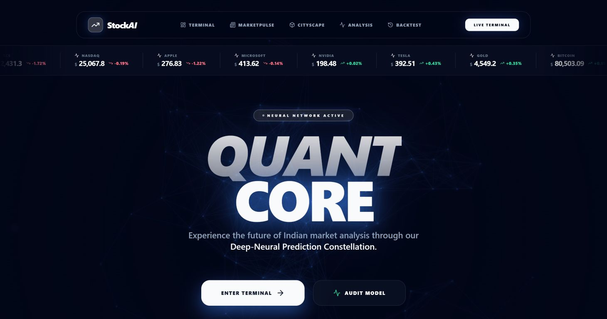
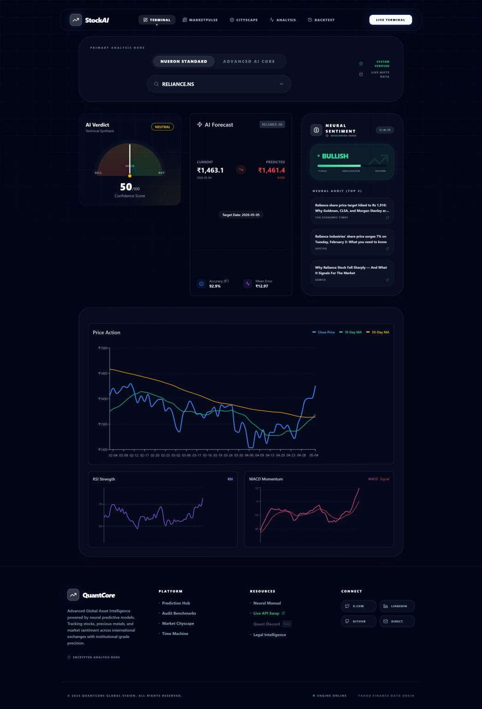
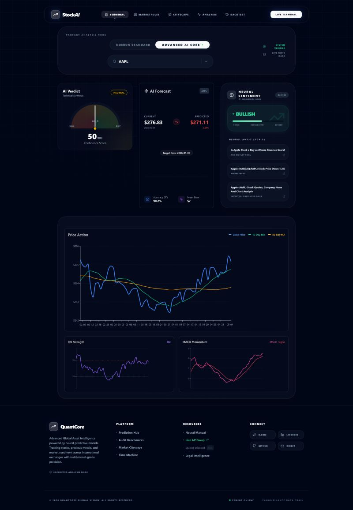
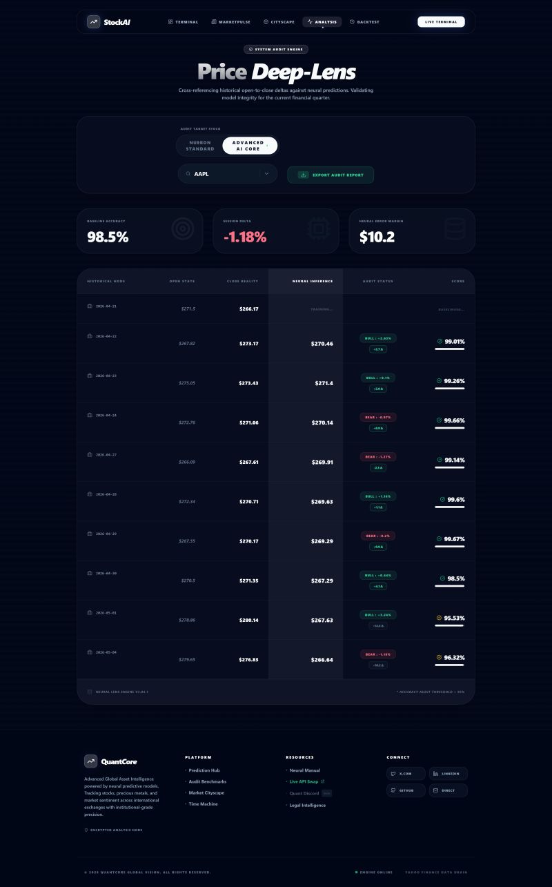
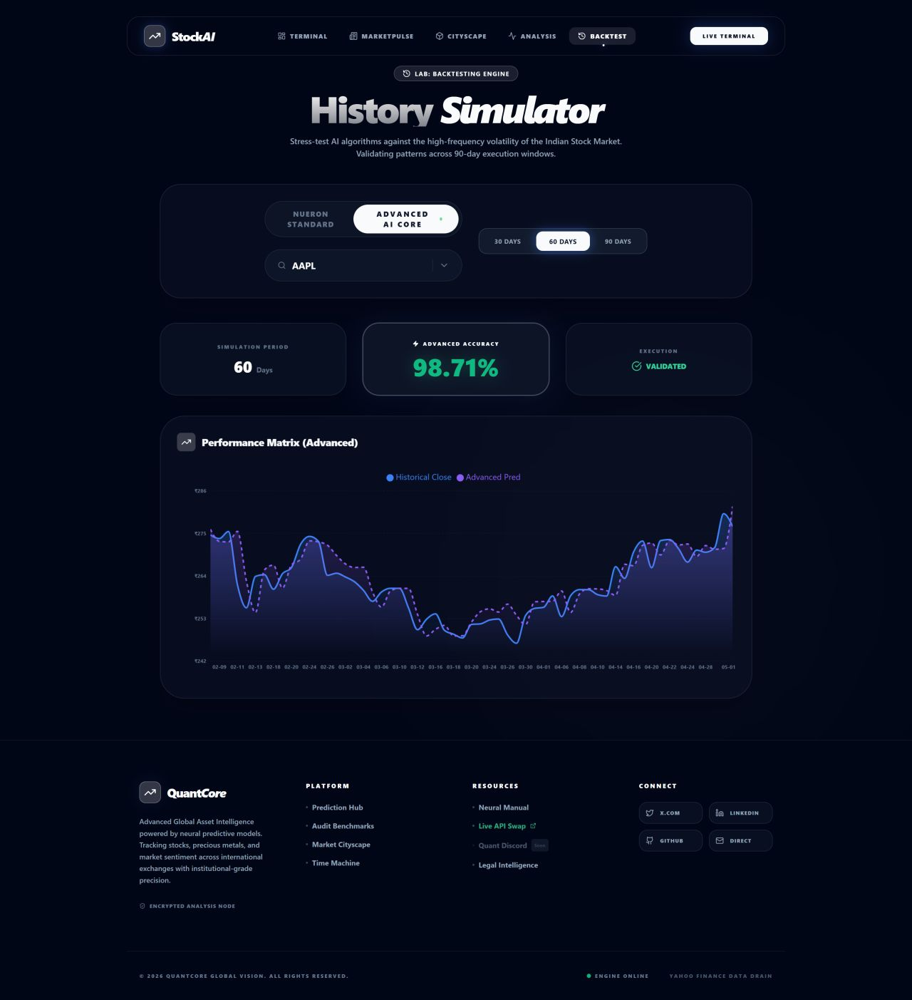
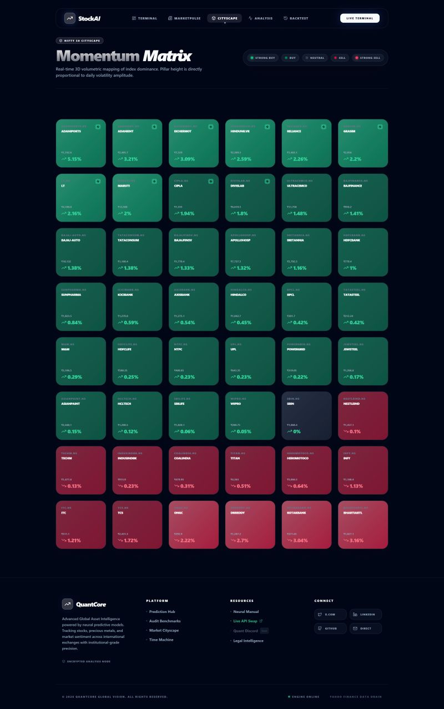

# QuantCore - Indian & International Stock Market Predictor 📈

An advanced, AI-powered web application for predicting Indian (NIFTY 50) and international stock prices (such as Apple, Google, Microsoft, NVIDIA, and Tesla). This full-stack application combines machine learning models with real-time sentiment analysis and a global market search engine to provide comprehensive investment insights.


## 🚀 Key Features

### 🤖 AI-Powered Predictions & Global Reach
- **Global Stock Coverage**: Seamless support for both Indian NSE/BSE tickers and major international equities (e.g. US stock markets), commodities (Gold), and cryptocurrencies (Bitcoin).
- **Dynamic Search Engine**: Instant searching across world exchanges via `yahooquery` integration to analyze any global financial asset.
- **Dual Model System**:
  - **Linear Regression**: Fast, trend-based predictions.
  - **LSTM Neural Network**: Deep learning for complex time-series forecasting.
- **Model Persistence**: Automatically saves trained models for instant subsequent load times.

### 📱 Progressive Web App (PWA)
- **Standalone Mobile Installation**: Install the application directly onto your Android/iOS home screen with customized high-res icons.
- **Offline & Manifest Capabilities**: Uses `vite-plugin-pwa` to register service workers and set up manifest configs for native-like app styling.

### 🧠 Sentiment Analysis
- **Real-Time News**: Fetches latest financial headlines for specific stocks.
- **Smart Scoring**: Uses VADER NLP to assign Bullish/Bearish scores to news.
- **Market Pulse**: Dedicated News page tracking sector performance and global trends.

### 📊 Interactive Dashboard
- **Advanced Charts**: Interactive price charts with zoom, panner, and tooltips.
- **Technical Indicators**: Toggle RSI (Relative Strength Index) and MACD overlays.
- **Comparison Mode**: Split-screen view to compare two stocks side-by-side.
- **Watchlist**: Save your favorite stocks for quick access (persisted locally).
- **Stock Marquee Ticker**: Real-time infinite-scrolling ticker bar tracking top indices and active stock updates at a glance.

### 🌐 Modern Architecture & Mobile Access
- **Multi-Page Layout**: Landing, Dashboard, News, Features, and About pages.
- **Local Network Sharing**: Fully configured to bind to `0.0.0.0` (backend) and `--host` (frontend) allowing direct cross-device testing.

---

## 📸 Application Screenshots

Here are screenshots of the **QuantCore** stock predictor application in action:

| Screen 1 | Screen 2 |
| :---: | :---: |
|  |  |

| Screen 3 | Screen 4 |
| :---: | :---: |
|  |  |

| Screen 5 | Screen 6 |
| :---: | :---: |
|  |  |

---


## 🛠️ Tech Stack

### Frontend
- **React (Vite)**: Fast, modern UI framework.
- **Tailwind CSS**: Utility-first styling for a custom, premium look.
- **Framer Motion**: Production-ready animations.
- **Recharts**: Composable charting library.
- **Lucide React**: Beautiful, consistent icons.

### Backend
- **FastAPI**: High-performance Python web framework.
- **TensorFlow/Keras**: For LSTM model training and inference.
- **Scikit-Learn**: For Linear Regression and data preprocessing.
- **yFinance**: For fetching real-time stock market data.
- **VADER Sentiment**: For natural language processing of news.

---

## ⚡ Quick Start

### Prerequisites
- Node.js & npm
- Python 3.8+

### One-Command Launch (Recommended)
We have streamlined the startup process. You only need to run **one command** in the root directory to start both the Frontend and Backend servers simultaneously.

1. Open your terminal in the project root (`d:\Projects\Stock Market`).
2. Run:
   ```bash
   npm start
   ```
3. The app will open automatically in your browser at `http://localhost:5173`.
4. **Mobile / Local Network Testing**:
   - Make sure your mobile device is on the same Wi-Fi network as your computer.
   - Find your computer's local IP address (e.g. `192.168.1.15`).
   - Open `http://<YOUR_LOCAL_IP>:5173` on your smartphone's browser.
   - Tap **"Add to Home Screen"** or the Install prompt to install the application as a standalone PWA!

### Manual Setup (Legacy)
If you prefer to run servers separately:

**Backend:**
```bash
cd backend
venv\Scripts\activate
uvicorn main:app --reload
```

**Frontend:**
```bash
cd frontend
npm run dev
```

---

## 📂 Project Structure

```
/
├── backend/                 # FastAPI Python Server
│   ├── models/              # Saved .keras and .pkl models
│   ├── main.py              # API Entry Point
│   ├── stocks.py            # NIFTY 50 Stock List
│   └── sentiment.py         # News & NLP Logic
│
├── frontend/                # React Vite Application
│   ├── src/
│   │   ├── components/      # Reusable UI (Navbar, Charts, Cards)
│   │   ├── pages/           # Route Pages (Dashboard, News, Landing)
│   │   └── ...
│   └── package.json
│
├── package.json             # Root config for "npm start"
└── README.md                # Documentation
```

## 📝 License
This project is open-source and available under the MIT License.
